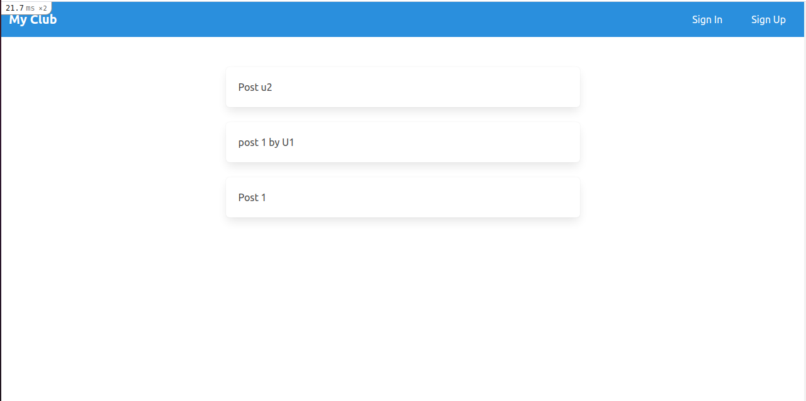
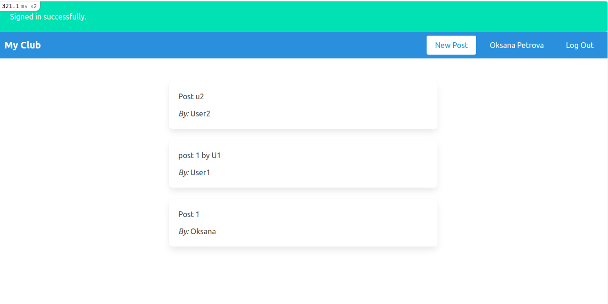

# README
This project is about an exclusive clubhouse where your members can write anonymous posts. Inside the clubhouse, members can see who the author of a post is but, outside, they can only see the story and wonder who wrote it.

The Odin Project 

* Prerequisites
- ruby '2.7.2'
- rails '6.1.1'

* Clone this repository https://github.com/Laguna1/m-embers-only
- run `cd m-embers-only` in your terminal

* Setup
- Instal gems with: `bundle install`

* Database creation: `rails db:create`
* Database initialization:`rails db:migrate`

* How to run 
- Start server with: `rails s`

## Author

👤 **Oksana Petrova**

- GitHub:[@github/Laguna1](https://github.com/Laguna1)
- Linkedin:[linkedin/OksanaPetrova](https://www.linkedin.com/in/oksana-petrova/)
- Twitter:[@OksanaP48303303](https://twitter.com/OksanaP48303303)

## 🤝 Contributing

Contributions, issues and feature requests are welcome!

Feel free to check the [issues page](https://github.com/Laguna1/m-embers-only/issues).

## Show your support

Give a ⭐️ if you like this project!